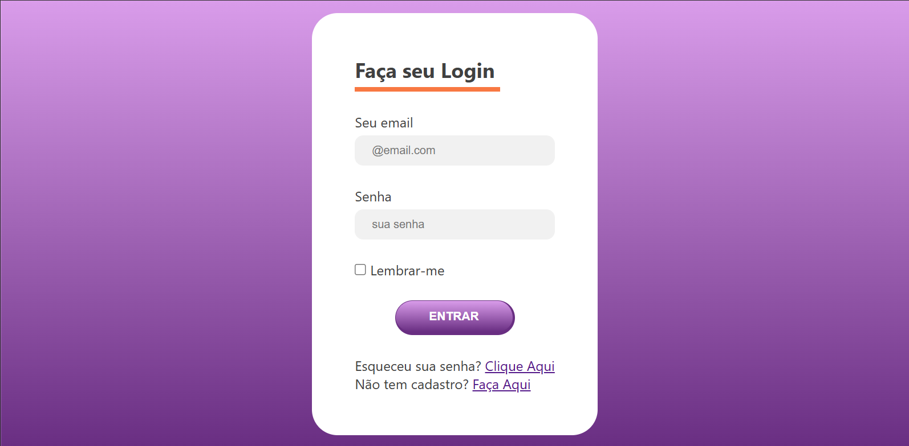

# Formulário de Login 🔐

Este projeto é uma página de login criada para praticar HTML e CSS.

## 📌 Funcionalidades
- Formulário de login com campos de e-mail e senha.
- Botão de acesso.
- Layout simples e organizado.

## 🚀 Tecnologias utilizadas
- HTML5
- CSS3

## 💻 Como visualizar o projeto
1. Faça o download ou clone este repositório:
   ```bash
   git clone https://github.com/amandhamdo/Form-Login.git

📸 Imagem do Projeto



📚 Aprendizados

Criação de estrutura de login.

Estilização de formulários e botões.
